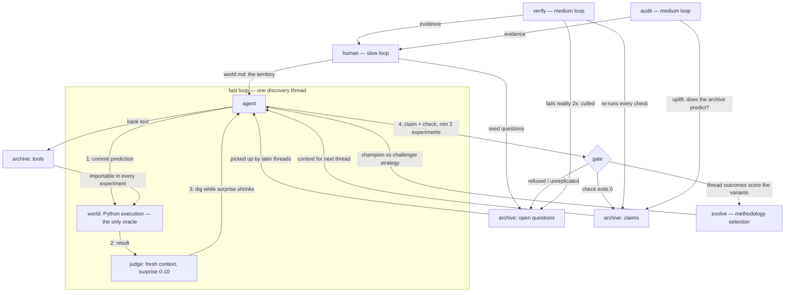

# disco

## Imagine

Imagine a curious kid locked in a room with a computer and nothing else — no books,
no teacher. The kid pokes at things, but with one house rule: **before every poke,
write down what you think will happen.** When the computer does something different,
that's the fun part — poke *there* again until it makes sense. When the kid finally
understands something, they may write it on the wall — but only if they also write a
test anyone can run to prove it, and only after checking it more than once. Useful
gadgets the kid builds stay in a toolbox for tomorrow. Slowly the walls fill with
proven facts and the toolbox with instruments — none of it taught, all of it earned.

**disco** is that room. The kid is an LLM; the pokes are Python experiments; the wall is
`worlds/<name>/archive/claims/`; the toolbox is `worlds/<name>/archive/tools/`. The
harness never tells it what's
true or what to try — it only enforces the house rules: predict first, reality decides,
replicate before you claim, nothing enters the wall without a runnable proof. And the
room itself is swappable: point it at a different **world** — a codebase, a database, a
simulated universe — and the same kid starts filling different walls (see [Worlds](#worlds)).

## Discovered so far

None of this was taught; all of it was earned, and every claim re-proves itself on your
machine. In the **sim-life** world (Conway's Game of Life on toruses), the agent built
its own bit-parallel physics engine, then 18 instruments on top of it, and holds 19
machine-verified claims: complete functional graphs of the 4×4 (65,536 states) and 4×5
(1,048,576 states) universes; Garden-of-Eden fractions; the still-life maximum
`floor(WH/2)` proven by dynamic programming; gliders found twice — first as anomalous
drifting attractors in soup debris, then characterized exactly (true spaceship iff
`min(W,H) ≥ 5`, degenerating to a period-8 oscillator on 4×4); a genuine localized
spaceship on 4×5 found via drift analysis; the ash-density phase cliff near initial
density 0.78; and r-pentomino behavior under wraparound. In the **python** world (git
history), it mapped what CPython 3.14 actually changed: incremental GC semantics, PEP
649 deferred annotations, PEP 734 subinterpreters' two-tier object passing, PEP 750
t-strings. Run `python3 disco.py -w sim-life verify` and watch reality re-confirm all
of it, including the million-state census, from scratch. In **generated worlds**
(random rules no literature has ever described) the agent discovered laws with
zero pretraining support — gen-42's damage propagation is direction-asymmetric:
a 1→0 flip spreads unbounded while a 0→1 flip stays frozen forever, found
through a surprise arc of 8→3→8→10→0. And in the first **multi-agent** session,
two agents sharing one archive divided the territory between themselves with no
coordinator (crowding overlap 0.246) — one of them discovering and claiming a
bug in the archive's own instruments.

## Design

A minimal discovery harness. Not an optimizer: no task set, no benchmark, no champion.
The agent generates its own questions about its **world** — a pluggable territory
defined in `worlds/<name>/world.md`; the default world is the Python software
environment of this machine — commits falsifiable predictions before running
experiments, and only what survives an executable check enters that world's
knowledge archive.

Design principle: **freeze the judge, free the mind.** The kernel contains zero domain
knowledge — it bakes in exactly one meta-method (predict → test → compress → archive)
and the agent discovers everything inside it.

## Mechanics

Each thread (up to 8 steps):

1. **PREDICT** — the agent commits an expected outcome + confidence *before* execution;
   strong predictions add **PREDICT_CODE**, executable assertions the kernel runs
   against the actual result — held caps surprise at 3, violated floors it at 6,
   so the objective verdict bounds the judge instead of the other way around.
2. **RUN** — the kernel executes the experiment (subprocess, 30s timeout). Only oracle.
3. **SURPRISE** — a separate judge call (fresh context, no memory of the agent's
   reasoning) scores prediction vs. reality, 0–10. Kernel-logged, unfakeable.
4. **BRANCH** — `CONTINUE` (dig deeper), `CLAIM` (ship a fact + runnable check),
   `QUESTION` (park a surprise), or `NOISE` (surprise didn't shrink; abandon).

Frozen rules:

- **No claim without a check.** `check.py` must exit 0 or the claim is rejected.
- **Laws compress the archive.** A claim may supersede archived claims it strictly
  generalizes: the kernel folds them into the law (its check inherits their burden),
  and the index shrinks as understanding grows.
- **No claim without replication.** Claims backed by fewer than 2 experiments are
  refused; if the agent insists, the kernel parks the claim as an open question.
- **Learnability over novelty.** Interesting = surprise that shrinks under study.
- **Only the kernel writes** the ledger and the archive.
- **Tools are inherited.** The world's `archive/tools/` is on the `PYTHONPATH` of every experiment —
  reuse is executable, not citation.
- **Selection, not debate.** A claim whose check fails reality on 2 consecutive `verify`
  runs is culled — demoted back to an open question to be re-earned or refuted. The
  archive is a population; reality is its environment. `verify` runs automatically
  before every `run` session, so the agent always starts from a reality-checked archive.

Three speeds:

- fast — `disco run`: the surprise-driven loop above; never sees the audit metric
- medium — `disco verify` / `disco audit`: reality re-checks the archive and culls what
  rots; uplift = accuracy(with archive) − accuracy(without) for a fresh model
- slow — you: read the archive, seed domains, prune degenerate obsessions

## The graph

Not one loop — a graph of loops at three speeds, every path anchored in execution:



The fast loop never sees the audit metric (no metric to game); the agent never writes
the archive (only the gate does); curiosity itself is anchored — surprise is scored
against a prediction committed *before* execution, by a judge that never saw the
agent's reasoning.

## Self-evolving methodology

The agent's *strategy* — how it picks questions, designs experiments, decides when to
claim — lives in `worlds/<name>/methodology.md`: self-authored text injected into its
prompt, which the kernel never writes. It evolves by champion/challenger selection:

1. A fresh model call proposes a challenger methodology from ledger evidence
   (outcomes, rejections, culled claims). Capped at 350 words — bloat is a mutation
   that dies at birth.
2. Champion and challenger alternate live threads (4 each per generation).
3. Frozen fitness scores each thread: admitted claim +3, rejected claim −2, honest
   parked question +1, kernel-parked premature claim −0.5, parse/syntax failure −1.
4. The winner becomes champion (ancestors kept in `methodology-history/`); the loser
   is deleted; the next generation begins.

The agent writes its own rules of conduct; reality decides which rulebook survives.
`disco evolve` shows the current generation, champion text, and trial progress.
Disable with `DISCO_EVOLVE=0`. Honest caveats: 4-vs-4 trials are noisy (real signal
accumulates over generations), and fitness favoring admitted claims pressures toward
easy truths — the audit's uplift measure is the counter-metric to watch.

## Usage

Requires Python 3.10+, stdlib only. An OpenAI-compatible endpoint must be up
(default: LM Studio at `http://localhost:1234/v1`, model `qwen3.6-27b-med-slo@f16`).

```sh
python3 disco.py run -n 5     # five discovery threads
python3 disco.py status       # archive index + recent ledger
python3 disco.py audit        # naive-agent uplift measurement
python3 disco.py verify       # re-run every claim check (claims-rot audit)
python3 disco.py reset        # fresh start — stashes the world's archive/runs/ledger into attic/<world>-<ts>/
python3 disco.py seed "sqlite transaction semantics" "when does a write lock actually engage?"
python3 disco.py stats        # discovery-efficiency metrics (surprise, closure)
python3 disco.py deps         # claim -> tool dependency graph
python3 disco.py export       # threads -> training episodes (JSONL)
python3 disco.py genworld 7 --family modpoly   # contamination-free random world
python3 disco.py grind 100 101 102 -n 3        # batch: generate + run + export
python3 disco.py run -n 8 --agents alice,bob   # multi-agent: shared archive, own methodologies
python3 disco.py calib        # cross-world calibration: confidence vs surprise
python3 disco.py coevolve     # POET loop: world population at the competence frontier
python3 disco.py rollout -g 8 # GRPO group sampling from one frozen context
```

`seed` is the human steering channel: it parks a question in the world's `archive/open-questions/`,
which the agent sees at the start of every thread and may pick up. Seed territory, not
instructions — the discovering is its job.

## Worlds

The kernel is a domain-agnostic epistemology engine; the *world* — the territory the
agent explores — is configuration. A world is a directory `worlds/<name>/` holding a
`world.md` (the territory description injected into the agent's prompt — the only
domain-content file in the system) plus that world's own archive, runs, and ledger.
The actuator is always Python: it's the universal instrument, and anything drivable
from Python — repos, databases, servers, simulations — is explorable territory.

```sh
python3 disco.py worlds                       # list worlds and claim counts
python3 disco.py newworld legacy "Your world is the codebase at /path/to/repo. \
Discover its actual behavior — invariants, quirks, undocumented contracts — as \
runnable characterization tests."
python3 disco.py -w legacy run -n 5           # explore it (or DISCO_WORLD=legacy)
python3 disco.py -w legacy verify             # its claims, re-checked
```

**Fit test** — a domain works when all four hold:

1. **Cheap oracle** — reality answers in seconds and cannot be argued with.
2. **Predictable** — outcomes can be stated up front, specifically enough to be wrong.
3. **Re-checkable** — claim checks can re-ask reality anytime, forever.
4. **Safe to poke** — observing does not mutate or damage the world.

Good fits: legacy codebases (claims become characterization tests), dependency
upgrades (behavioral diff between versions), undocumented APIs and file formats,
database/infra semantics, simulated universes (see `worlds/sim-life/`), experimental
math. Poor fits: taste domains (no oracle), retrieval facts (check verifies fetching,
not truth), slow or costly oracles (real lab experiments), and live production
systems (pokes mutate the world — explore staging, run `verify` against prod).

### Claude backend

With [Claude Code](https://claude.com/claude-code) installed and authenticated, the agent
can run through `claude -p` instead of a local model — no LM Studio needed:

```sh
DISCO_BACKEND=claude python3 disco.py run -n 5
DISCO_BACKEND=claude DISCO_CLAUDE_MODEL=sonnet python3 disco.py run -n 1   # pin a model
DISCO_BACKEND=claude python3 disco.py audit
```

Each model call is a stateless `claude -p --output-format text --max-turns 1` subprocess;
all outputs still land in the world's `runs/`, `archive/`, `ledger.jsonl` exactly as with LM Studio.
(Temperature is not controllable through the CLI; judge calls are less deterministic.)

### Config

Env vars: `DISCO_WORLD` (default `python`), `DISCO_BACKEND` (`openai`|`claude`),
`DISCO_BASE_URL`, `DISCO_MODEL`, `DISCO_CLAUDE_MODEL`, `DISCO_MAX_STEPS` (default 8),
`DISCO_MIN_CLAIM` (experiments required before a claim is admissible, default 2),
`DISCO_CULL_AFTER` (consecutive verify failures before a claim is demoted, default 2),
`DISCO_EVOLVE` (`0` disables methodology evolution), `DISCO_TRIAL_THREADS` (threads
per variant per generation, default 4), `DISCO_METH_CAP` (methodology word cap,
default 350), `DISCO_EXEC_TIMEOUT`, `DISCO_TEMPERATURE`.

## Warning

Experiments are model-written Python executed on your machine as your user, with network
access. This is an isolation boundary in the epistemic sense only, not a security sandbox.
If that is a concern, run the whole harness inside a VM or container.

## Layout

```
kernel/                         frozen: loop, world (executor), archive rules, judge,
                                audit, evolve (methodology selection)
worlds/<name>/world.md          territory description — the only domain-content file
worlds/<name>/archive/          claims/ (claim.md + check.py + meta.json), tools/,
                                open-questions/
worlds/<name>/methodology.md    agent-authored strategy (absent until evolution
                                promotes the first winner)
worlds/<name>/methodology-history/  promoted ancestors, one per generation
worlds/<name>/evolution.json    trial state: generation, per-variant outcomes
worlds/<name>/runs/             per-thread workdirs: predictions, code, results, and
                                messages.jsonl — the full transcript, so any thread
                                can be replayed or forked
worlds/<name>/ledger.jsonl      append-only, kernel-written
```

## Trajectories: discovery as training data

Every thread disco runs is a fully explained trajectory, and `disco export`
turns them into training episodes (JSONL, one per thread):

- **steps** — for each experiment: the committed prediction with stated
  confidence, the code, the actual execution result, the judge's surprise score
  (0–10), and a **process reward** (how much surprise this step closed).
- **outcome reward** — the frozen mechanism fitness (+3 admitted, −2 rejected,
  −3 later culled...), execution-anchored: computed by the gate and verify, not
  by anyone's opinion.
- **filters** — trajectory-level labels for data curation: `gate_passed`
  (check actually exited 0), `verified_alive` (still surviving reality's
  re-checks), `closed_surprise` (the thread learned, not just wandered).
- **calibration** — (confidence, surprise) pairs per step; across the current
  corpus, stated confidence anti-correlates with surprise at r ≈ −0.54: the
  agent knows when it doesn't know.
- **attribution** — which world, which agent lineage, and (for `disco rollout`)
  a shared **group id**: G trajectories sampled from one frozen context, ready
  for group-relative advantage computation (GRPO-style). Group-relative
  normalization cancels per-world difficulty; saturated worlds yield std=0
  groups, which is why groups are sampled at the coevolve frontier.

What makes these episodes unusual as data: web text contains humanity's
conclusions, while these trajectories contain the *revision process* — belief,
falsification, correction, verification — with every label anchored in code
that actually ran. Worlds rolled by `genworld` guarantee the truths involved
exist in no pretraining corpus, so first-contact surprise separates recall from
discovery measurably (documented worlds open at 0–3, generated ones at 5–8),
and held-out generated worlds make the clean eval: transfer means the model
learned discovering, not discoveries.

The pipeline end to end: `coevolve` keeps a population of generated worlds at
the competence frontier → `run` / `grind` / `rollout` fill `exports/` with
reward-labeled trajectories → your trainer consumes the JSONL. See
[docs/roadmap.md](docs/roadmap.md) for the recipe mapping.

### How to train on them

One episode (one thread) looks like this — every field is emitted by
`disco export`, nothing is inferred later:

```json
{
  "world": "gen-1002", "agent": "bob", "thread": "20260726-...", "slug": "on-rule-...",
  "ending": "claim", "admitted": true, "reward": 3.0,
  "mean_surprise": 5.0, "closure": 8,
  "filters": {"gate_passed": true, "verified_alive": true, "closed_surprise": true},
  "calibration": [[35, 5], [80, 1]],
  "steps": [
    {"n": 1, "focus": "cycle structure", "prediction": "...", "confidence": 35,
     "code": "from ca_rule import step\n...", "objective": "held",
     "result": {"exit": 0, "stdout": "...", "stderr": "", "timeout": false},
     "surprise": 5, "process_reward": null, "judge_note": "..."},
    {"n": 2, "...": "...", "surprise": 1, "process_reward": 4}
  ],
  "claim": "For rule ... every cyclic tape of width W ...",
  "check": "import sys; ...\nsys.exit(0 if ... else 1)",
  "transcript": [{"role": "system", "content": "..."}, {"role": "assistant", "content": "..."}]
}
```

**SFT — clone successful discovery, filtered two ways (the Nanbeige move).**
`transcript` is already the exact message sequence the model emitted, so it is
a ready fine-tuning target; filter it at two granularities:

```python
import json
episodes = [json.loads(l) for l in open("exports/gen-1002.jsonl")]

# trajectory-level: keep threads whose discovery passed its check AND survived
# reality's later re-checks; require closed_surprise for the strongest set
keep = [e for e in episodes
        if e["filters"]["gate_passed"] and e["filters"]["verified_alive"]
        and e["filters"]["closed_surprise"]]

# turn-level: drop the steps where the agent's OWN committed assertions failed
for e in keep:
    e["steps"] = [s for s in e["steps"] if s.get("objective") != "violated"]
    # → SFT on e["transcript"], or prompt = system+prior turns, completion = assistant turn
```

**GRPO — group-relative advantages (rollout exports only).** `disco rollout`
tags each of the G trajectories with a shared `group`; bucket and normalize:

```python
from collections import defaultdict
groups = defaultdict(list)
for l in open("exports/rollouts-gen-1002.jsonl"):
    e = json.loads(l)
    groups[e["group"]].append(e)

for eps in groups.values():
    # shade the (often saturated) outcome reward with process signal before
    # normalizing — strong models land +3 every rollout, so closure carries the group
    shaped = [e["reward"] + 0.3 * (e["closure"] or 0) for e in eps]
    mu = sum(shaped) / len(shaped)
    sd = (sum((x - mu) ** 2 for x in shaped) / len(shaped)) ** 0.5
    for e, x in zip(eps, shaped):
        e["advantage"] = (x - mu) / sd if sd else 0.0   # feed to your policy update
```

Rewards are execution-anchored (gate + verify, not judge opinion), so the
advantages resist hacking. Logprobs, KL-to-reference, and token-level credit
are your trainer's job — disco supplies `(context, trajectory, reward, group)`.

**Calibration head.** The `calibration` (confidence, surprise) pairs train a
confidence predictor under a proper scoring rule; the corpus already carries the
signal (r ≈ −0.54, confidence anti-correlates with surprise).

**Uncontaminated eval.** Train on one set of `genworld` seeds, evaluate on
held-out seeds (`--difficulty` to raise the bar). The score is first-contact
surprise closure on worlds the model has never seen: transfer means it learned
*to discover*, not the discoveries. `disco stats` reports the per-world numbers;
`disco calib` aggregates calibration across worlds.

## Deeper docs

- [docs/games.md](docs/games.md) — the game-theoretic skeleton: claim admission
  as verifier/falsifier games, the kernel as mechanism design, methodology
  evolution as replicator dynamics, and the unbuilt multi-agent layer.
- [docs/roadmap.md](docs/roadmap.md) — the goal: disco as a discovery engine
  with worlds as RL environments; pillar status and sequencing.
- [docs/predictions.md](docs/predictions.md) — pre-registered predictions for
  every world, with [full discovery programs](docs/predictions/) per world.

Training-facing commands: `disco.py export` turns a world's threads into
episode JSONL (trajectories, surprise scores, execution-anchored rewards);
`disco.py genworld <seed>` rolls a procedurally generated CA world whose truths
cannot exist in any pretraining corpus — the contamination-free territories for
teaching and testing discovery itself.

## License

[GPL-3.0](LICENSE) — free to use, study, and modify; derivatives must remain open
under the same terms, with attribution. Copyright (C) 2026 Tadej Fius.
