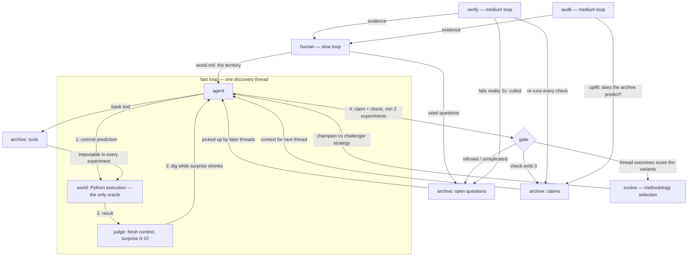

# disco

## Imagine

Imagine a curious kid locked in a room with a computer and nothing else — no books,
no teacher. The kid pokes at things, but with one house rule: **before every poke,
write down what you think will happen.** When the computer does something different,
that's the fun part — poke *there* again until it makes sense. When the kid finally
understands something, they may write it on the wall — but only if they also write a
test anyone can run to prove it, and only after checking it more than once. Useful
gadgets the kid builds stay in a toolbox for tomorrow. Slowly the walls fill with
proven facts and the toolbox with instruments — none of it taught, all of it earned.

**disco** is that room. The kid is an LLM; the pokes are Python experiments; the wall is
`worlds/<name>/archive/claims/`; the toolbox is `worlds/<name>/archive/tools/`. The
harness never tells it what's
true or what to try — it only enforces the house rules: predict first, reality decides,
replicate before you claim, nothing enters the wall without a runnable proof. And the
room itself is swappable: point it at a different **world** — a codebase, a database, a
simulated universe — and the same kid starts filling different walls (see [Worlds](#worlds)).

## Design

A minimal discovery harness. Not an optimizer: no task set, no benchmark, no champion.
The agent generates its own questions about its **world** — a pluggable territory
defined in `worlds/<name>/world.md`; the default world is the Python software
environment of this machine — commits falsifiable predictions before running
experiments, and only what survives an executable check enters that world's
knowledge archive.

Design principle: **freeze the judge, free the mind.** The kernel contains zero domain
knowledge — it bakes in exactly one meta-method (predict → test → compress → archive)
and the agent discovers everything inside it.

## Mechanics

Each thread (up to 8 steps):

1. **PREDICT** — the agent commits an expected outcome + confidence *before* execution.
2. **RUN** — the kernel executes the experiment (subprocess, 30s timeout). Only oracle.
3. **SURPRISE** — a separate judge call (fresh context, no memory of the agent's
   reasoning) scores prediction vs. reality, 0–10. Kernel-logged, unfakeable.
4. **BRANCH** — `CONTINUE` (dig deeper), `CLAIM` (ship a fact + runnable check),
   `QUESTION` (park a surprise), or `NOISE` (surprise didn't shrink; abandon).

Frozen rules:

- **No claim without a check.** `check.py` must exit 0 or the claim is rejected.
- **No claim without replication.** Claims backed by fewer than 2 experiments are
  refused; if the agent insists, the kernel parks the claim as an open question.
- **Learnability over novelty.** Interesting = surprise that shrinks under study.
- **Only the kernel writes** the ledger and the archive.
- **Tools are inherited.** The world's `archive/tools/` is on the `PYTHONPATH` of every experiment —
  reuse is executable, not citation.
- **Selection, not debate.** A claim whose check fails reality on 2 consecutive `verify`
  runs is culled — demoted back to an open question to be re-earned or refuted. The
  archive is a population; reality is its environment. `verify` runs automatically
  before every `run` session, so the agent always starts from a reality-checked archive.

Three speeds:

- fast — `disco run`: the surprise-driven loop above; never sees the audit metric
- medium — `disco verify` / `disco audit`: reality re-checks the archive and culls what
  rots; uplift = accuracy(with archive) − accuracy(without) for a fresh model
- slow — you: read the archive, seed domains, prune degenerate obsessions

## The graph

Not one loop — a graph of loops at three speeds, every path anchored in execution:



The fast loop never sees the audit metric (no metric to game); the agent never writes
the archive (only the gate does); curiosity itself is anchored — surprise is scored
against a prediction committed *before* execution, by a judge that never saw the
agent's reasoning.

## Self-evolving methodology

The agent's *strategy* — how it picks questions, designs experiments, decides when to
claim — lives in `worlds/<name>/methodology.md`: self-authored text injected into its
prompt, which the kernel never writes. It evolves by champion/challenger selection:

1. A fresh model call proposes a challenger methodology from ledger evidence
   (outcomes, rejections, culled claims). Capped at 350 words — bloat is a mutation
   that dies at birth.
2. Champion and challenger alternate live threads (4 each per generation).
3. Frozen fitness scores each thread: admitted claim +3, rejected claim −2, honest
   parked question +1, kernel-parked premature claim −0.5, parse/syntax failure −1.
4. The winner becomes champion (ancestors kept in `methodology-history/`); the loser
   is deleted; the next generation begins.

The agent writes its own rules of conduct; reality decides which rulebook survives.
`disco evolve` shows the current generation, champion text, and trial progress.
Disable with `DISCO_EVOLVE=0`. Honest caveats: 4-vs-4 trials are noisy (real signal
accumulates over generations), and fitness favoring admitted claims pressures toward
easy truths — the audit's uplift measure is the counter-metric to watch.

## Usage

Requires Python 3.10+, stdlib only. An OpenAI-compatible endpoint must be up
(default: LM Studio at `http://localhost:1234/v1`, model `qwen3.6-27b-med-slo@f16`).

```sh
python3 disco.py run -n 5     # five discovery threads
python3 disco.py status       # archive index + recent ledger
python3 disco.py audit        # naive-agent uplift measurement
python3 disco.py verify       # re-run every claim check (claims-rot audit)
python3 disco.py reset        # fresh start — stashes the world's archive/runs/ledger into attic/<world>-<ts>/
python3 disco.py seed "sqlite transaction semantics" "when does a write lock actually engage?"
```

`seed` is the human steering channel: it parks a question in the world's `archive/open-questions/`,
which the agent sees at the start of every thread and may pick up. Seed territory, not
instructions — the discovering is its job.

## Worlds

The kernel is a domain-agnostic epistemology engine; the *world* — the territory the
agent explores — is configuration. A world is a directory `worlds/<name>/` holding a
`world.md` (the territory description injected into the agent's prompt — the only
domain-content file in the system) plus that world's own archive, runs, and ledger.
The actuator is always Python: it's the universal instrument, and anything drivable
from Python — repos, databases, servers, simulations — is explorable territory.

```sh
python3 disco.py worlds                       # list worlds and claim counts
python3 disco.py newworld legacy "Your world is the codebase at /path/to/repo. \
Discover its actual behavior — invariants, quirks, undocumented contracts — as \
runnable characterization tests."
python3 disco.py -w legacy run -n 5           # explore it (or DISCO_WORLD=legacy)
python3 disco.py -w legacy verify             # its claims, re-checked
```

**Fit test** — a domain works when all four hold:

1. **Cheap oracle** — reality answers in seconds and cannot be argued with.
2. **Predictable** — outcomes can be stated up front, specifically enough to be wrong.
3. **Re-checkable** — claim checks can re-ask reality anytime, forever.
4. **Safe to poke** — observing does not mutate or damage the world.

Good fits: legacy codebases (claims become characterization tests), dependency
upgrades (behavioral diff between versions), undocumented APIs and file formats,
database/infra semantics, simulated universes (see `worlds/sim-life/`), experimental
math. Poor fits: taste domains (no oracle), retrieval facts (check verifies fetching,
not truth), slow or costly oracles (real lab experiments), and live production
systems (pokes mutate the world — explore staging, run `verify` against prod).

### Claude backend

With [Claude Code](https://claude.com/claude-code) installed and authenticated, the agent
can run through `claude -p` instead of a local model — no LM Studio needed:

```sh
DISCO_BACKEND=claude python3 disco.py run -n 5
DISCO_BACKEND=claude DISCO_CLAUDE_MODEL=sonnet python3 disco.py run -n 1   # pin a model
DISCO_BACKEND=claude python3 disco.py audit
```

Each model call is a stateless `claude -p --output-format text --max-turns 1` subprocess;
all outputs still land in the world's `runs/`, `archive/`, `ledger.jsonl` exactly as with LM Studio.
(Temperature is not controllable through the CLI; judge calls are less deterministic.)

### Config

Env vars: `DISCO_WORLD` (default `python`), `DISCO_BACKEND` (`openai`|`claude`),
`DISCO_BASE_URL`, `DISCO_MODEL`, `DISCO_CLAUDE_MODEL`, `DISCO_MAX_STEPS` (default 8),
`DISCO_MIN_CLAIM` (experiments required before a claim is admissible, default 2),
`DISCO_CULL_AFTER` (consecutive verify failures before a claim is demoted, default 2),
`DISCO_EVOLVE` (`0` disables methodology evolution), `DISCO_TRIAL_THREADS` (threads
per variant per generation, default 4), `DISCO_METH_CAP` (methodology word cap,
default 350), `DISCO_EXEC_TIMEOUT`, `DISCO_TEMPERATURE`.

## Warning

Experiments are model-written Python executed on your machine as your user, with network
access. This is an isolation boundary in the epistemic sense only, not a security sandbox.
If that is a concern, run the whole harness inside a VM or container.

## Layout

```
kernel/                         frozen: loop, world (executor), archive rules, judge,
                                audit, evolve (methodology selection)
worlds/<name>/world.md          territory description — the only domain-content file
worlds/<name>/archive/          claims/ (claim.md + check.py + meta.json), tools/,
                                open-questions/
worlds/<name>/methodology.md    agent-authored strategy (absent until evolution
                                promotes the first winner)
worlds/<name>/methodology-history/  promoted ancestors, one per generation
worlds/<name>/evolution.json    trial state: generation, per-variant outcomes
worlds/<name>/runs/             per-thread workdirs: predictions, code, results
worlds/<name>/ledger.jsonl      append-only, kernel-written
```
